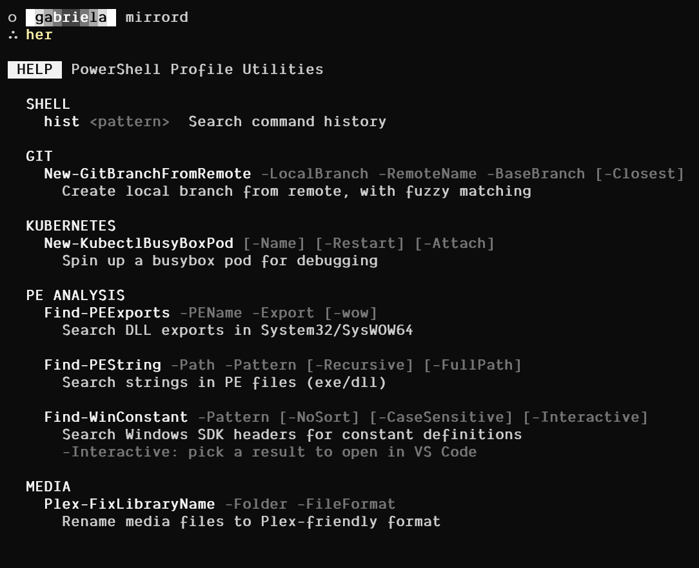

# PowerShell dotfiles



The contents of this file have been manually generated.

This is my PowerShell profile. It initializes Starship, sets execution to unrestricted, and initializes some utility commands I use every single day.

## Commands

### hist

```
> hist nuget*pack
PS C:\Users\allse> hist nuget*pack
Finding in full history using {$_ -like "*nuget*pack*"}
<# ... #>
C:\dev\CENSORED\.nuget\nuget.exe pack .\CENSORED.Ipc.Native.nuspec -p version=1.1.0
```
### Find-PEExports 

```
> Find-PEExports -wow kern* cre*file*mapp

 PE  Searching for exports matching 'cre*file*mapp' in '*kern**'

  kernel32.dll
    ord hint      rva name

    226   DF 0001CFB0  CreateFileMappingA
    227   E0  forward  CreateFileMappingFromApp (forwarded to api-ms-win-core-memory-l1-1-1.CreateFileMappingFromApp)
    228   E1 0005F660  CreateFileMappingNumaA
    229   E2 00030490  CreateFileMappingNumaW
    230   E3 0001C7A0  CreateFileMappingW

  KernelBase.dll
    ord hint      rva name

    220   D2 00178E10  CreateFile2FromAppW
    223   D5 00178ED0  CreateFileFromAppW
    224   D6 00243720  CreateFileMapping2
    225   D7 00243870  CreateFileMappingFromApp
    226   D8 00145EA0  CreateFileMappingNumaW
    227   D9 00145E70  CreateFileMappingW

 OK  Found 11 matching export(s)
```

### Find-PEString

```
> Find-PEString C:\Windows\System32\kernel32.dll "* ERROR *"

 STR  Searching for strings matching '* ERROR *' in C:\Windows\System32\kernel32.dll

  kernel32.dll
          offset text

         0x918A8  WER/Recovery/%u:%u: ERROR Invalid params
         0x918D8  WER/CrashAPI/%u:%u: ERROR Invalid args
         0x91900  WER/CrashAPI/%u:%u: ERROR Unable to get the pPeb, WerpCurrentPeb failed
         0x91950  WER/Heap/%u:%u: ERROR Invalid args
```

### Find-WinConstant

```
> Find-WinConstant "PROC_TH*" -CaseSensitive

 SDK  Searching for constants matching 'PROC_TH*'

  name                                     value

  PROC_THREAD_ATTRIBUTE_REPLACE_VALUE 0x00000001
  PROC_THREAD_ATTRIBUTE_NUMBER        0x0000FFFF
  PROC_THREAD_ATTRIBUTE_THREAD        0x00010000
  PROC_THREAD_ATTRIBUTE_INPUT         0x00020000
  PROC_THREAD_ATTRIBUTE_ADDITIVE      0x00040000

 OK  Found 5 matching constant(s)
```

Interactive mode:

```
> Find-WinConstant PROCESS_* -Interactive

 SDK  Searching for constants matching 'PROCESS_*'

   # name                                                             value file

   1 PROCESS_DPI_UNAWARE                                                  0 ShellScalingApi.h
   2 PROCESS_LOOPBACK_MODE_INCLUDE_TARGET_PROCESS_TREE                    0 audioclientactivationparams.h
   3 PROCESS_LOOPBACK_MODE_INCLUDE_TARGET_PROCESS_TREE                    0 audioclientactivationparams.idl
   4 PROCESS_CREATION_ALL_APPLICATION_PACKAGES_OPT_OUT                 0x01 WinBase.h
   5 PROCESS_CREATION_CHILD_PROCESS_RESTRICTED                         0x01 WinBase.h
   6 PROCESS_CREATION_DESKTOP_APP_BREAKAWAY_ENABLE_PROCESS_TREE        0x01 WinBase.h
   7 PROCESS_CREATION_MITIGATION_POLICY_DEP_ENABLE                     0x01 WinBase.h
   8 PROCESS_DEP_ENABLE                                          0x00000001 WinBase.h
   9 PROCESS_HEAP_REGION                                             0x0001 minwinbase.h
  10 PROCESS_LEAP_SECOND_INFO_FLAG_ENABLE_SIXTY_SECOND                  0x1 processthreadsapi.h
  11 PROCESS_LOOPBACK_MODE_EXCLUDE_TARGET_PROCESS_TREE                    1 audioclientactivationparams.h
  12 PROCESS_LOOPBACK_MODE_EXCLUDE_TARGET_PROCESS_TREE                    1 audioclientactivationparams.idl
  13 PROCESS_NAME_NATIVE                                         0x00000001 WinBase.h
  14 PROCESS_POWER_THROTTLING_CURRENT_VERSION                             1 processthreadsapi.h
  15 PROCESS_POWER_THROTTLING_EXECUTION_SPEED                           0x1 processthreadsapi.h
  16 PROCESS_SYSTEM_DPI_AWARE                                             1 ShellScalingApi.h
  17 PROCESS_CREATION_CHILD_PROCESS_OVERRIDE                           0x02 WinBase.h
  18 PROCESS_CREATION_DESKTOP_APP_BREAKAWAY_DISABLE_PROCESS_TREE       0x02 WinBase.h
  19 PROCESS_CREATION_MITIGATION_POLICY_DEP_ATL_THUNK_ENABLE           0x02 WinBase.h
  20 PROCESS_DEP_DISABLE_ATL_THUNK_EMULATION                     0x00000002 WinBase.h
  21 PROCESS_HEAP_UNCOMMITTED_RANGE                                  0x0002 minwinbase.h
  22 PROCESS_MEMORY_COUNTERS_EX                                           2 Psapi.h
  23 PROCESS_PER_MONITOR_DPI_AWARE                                        2 ShellScalingApi.h
  24 PROCESS_CREATION_CHILD_PROCESS_RESTRICTED_UNLESS_SECURE           0x04 WinBase.h
  25 PROCESS_CREATION_DESKTOP_APP_BREAKAWAY_OVERRIDE                   0x04 WinBase.h
  26 PROCESS_CREATION_MITIGATION_POLICY_SEHOP_ENABLE                   0x04 WinBase.h
  27 PROCESS_HEAP_ENTRY_BUSY                                         0x0004 minwinbase.h
  28 PROCESS_POWER_THROTTLING_IGNORE_TIMER_RESOLUTION                   0x4 processthreadsapi.h
  29 PROCESS_HEAP_SEG_ALLOC                                          0x0008 minwinbase.h
  30 PROCESS_HEAP_ENTRY_MOVEABLE                                     0x0010 minwinbase.h
  31 PROCESS_HEAP_ENTRY_DDESHARE                                     0x0020 minwinbase.h
  32 PROCESS_TRACE_MODE_REAL_TIME                                0x00000100 evntcons.h
  33 PROCESS_TRACE_MODE_RAW_TIMESTAMP                            0x00001000 evntcons.h
  34 PROCESS_MODE_BACKGROUND_BEGIN                               0x00100000 WinBase.h
  35 PROCESS_MODE_BACKGROUND_END                                 0x00200000 WinBase.h
  36 PROCESS_TRACE_MODE_EVENT_RECORD                             0x10000000 evntcons.h

 OK  Found 36 matching constant(s)

  Enter number to open in VS Code (1-36, or q to quit): 1

 CODE  Opening PROCESS_DPI_UNAWARE at ShellScalingApi.h:58
 ```

### New-GitBranchFromRemote
```
> New-GitBranchFromRemote -LocalBranch git-example -RemoteName daniel -BaseBranch win-43 -Closest
Fetching from 'daniel'...
Fetch complete.
No exact match. Use closest branch 'win-43-subprocessing'? (Y/n): y

About to run:
  git checkout -b git-example daniel/win-43-subprocessing

Proceed? (Y/n): n
Cancelled.
```

### Plex-FixLibraryName
```
> Plex-FixLibraryName -Folder .\Full.Moon.Wo.Sagashite\ -FileFormat mkv

Found 52 file(s) in .\Full.Moon.Wo.Sagashite\:

The following renames will be applied:
  'Full Moon wo Sagashite - 01v2.mkv' -> 'Full.Moon.wo.Sagashite.01v2.mkv'
  'Full Moon wo Sagashite - 02v2.mkv' -> 'Full.Moon.wo.Sagashite.02v2.mkv'
  (...)

Proceed with renaming? (y/n): n
```

### New-KubectlBusyBoxPod
```
> New-KubectlBusyBoxPod -Name fun -Restart "Always" -Attach
Pod 'fun' exists, status: 'Running'
Delete pod 'fun' and recreate it? (y/n): y
Deleting existing pod 'fun'...
Warning: Immediate deletion does not wait for confirmation that the running resource has been terminated. The resource may continue to run on the cluster indefinitely.
Pod 'fun' successfully deleted.
Creating BusyBox pod 'fun' with restart policy 'Always'...
Waiting for pod 'fun' to be ready...
Pod 'fun' is ready!
Attaching to /bin/sh inside 'fun'...
/ # mkdir app
/ # echo "hi github" > test.txt
/ # exit
```