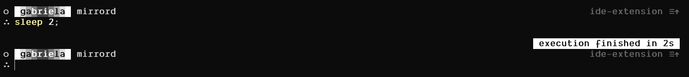

# Starship dotfiles

The contents of this file have been manually generated.

This is how my Starship prompt looks like. It tells you your git branch and how long a program took to execute, and other stuff.