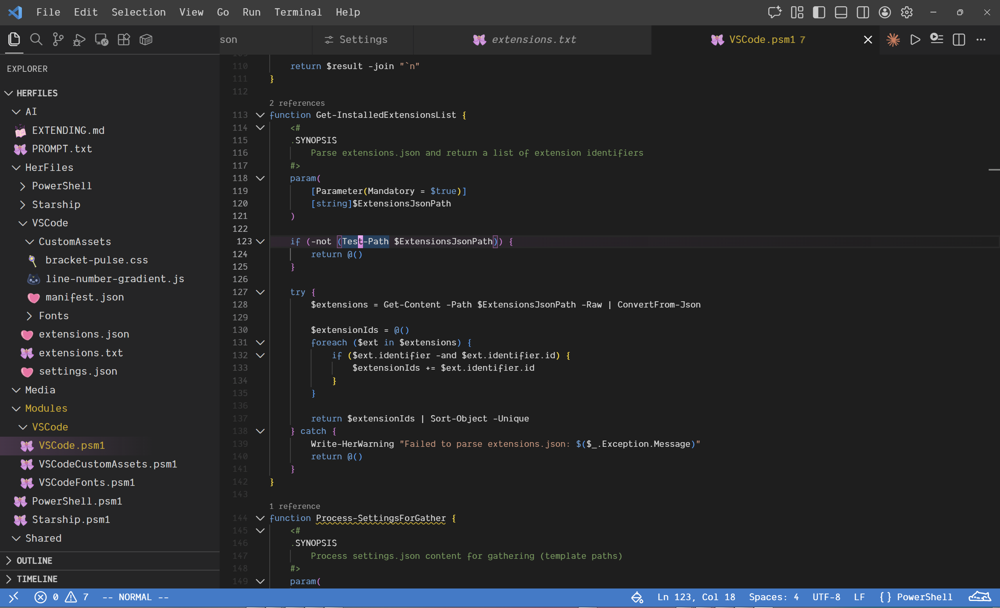

# VSCode dotfiles

The contents of this folder have been manually generated.

This configuration is meant to be more calming to use, but still has all the cute stuff I like. It's also thoroughly (and hopefully tastefully so,) animated and filled with personality.

## Special features

Subject to change.

- Faded gradient lines

    - Also implements an animation, pushing the current line number to the right after 0.5s.
- Bracket pulse

    - For any bracket-type character (`(`, `[`, `{`, ...) there is an animation pulsing both the open and closing brackets in and out.
- Custom CSS

    - Things like, gradients for current line;
    - Gradients for the explorer pane's current selected file;
    - Custom font for explorer pane;
    - Etc;

## Installation process

Will automatically install settings, extensions, custom JS/CSS files, fonts, etc.